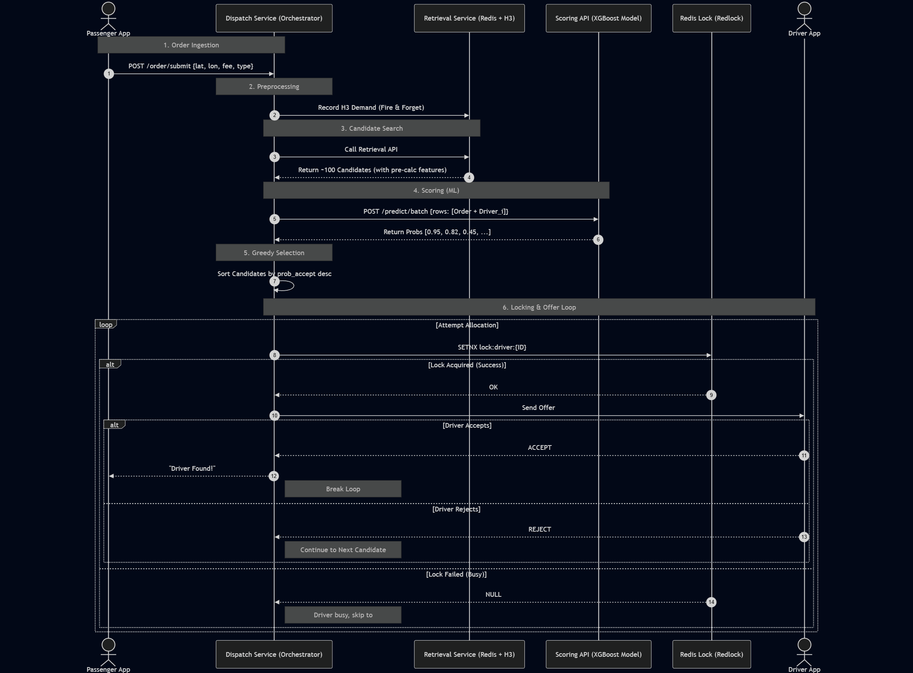
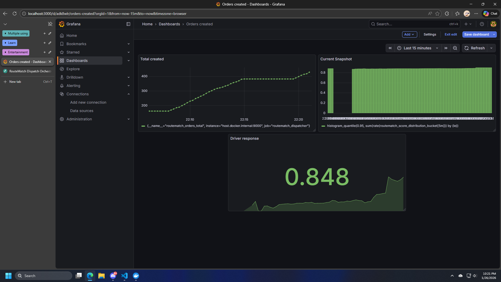

## 🗓️ Phase 1: Advanced Data Engineering & Simulation

**Objective:** Create a realistic data environment that simulates "Business Friction" (Rain, Traffic, Fatigue).

### 1.1 Relational Schema Design (PostgreSQL)
- Design normalized tables: `drivers`, `orders`, `interaction_logs` (logs of offers).
- Implement **PostGIS** extension for geospatial queries.
- **Key Challenge:** Design the `interaction_logs` table to capture *Negative Samples* (rejected offers), not just completed bookings.

### 1.2 Complex Event Simulation

#### 1.2.1 Driver Generation
- Generate 2,000 drivers with attributes:
    - `driver_id`: UUIDv4
    - `vehicle_type`: Enum (bike, truck_500, truck_1000)
    - `max_load_kg`: Integer (based on vehicle type)
    - `joined_date`: Random date within last 2 years

#### 1.2.2 Order Generation
- Generate 200,000 orders with attributes:
    - `order_id`: UUIDv4
    - `user_id`: random integer
    - `created_at`: Random timestamp within 30 days since 2024-01-01
    - `pickup_lat`, `pickup_lon`: Random coordinates within service area (~30km radius of Ho Chi Minh City center)
    - `dropoff_lat`, `dropoff_lon`: from 0.5km to 30km away from pickup location
    - `distance_km`: Calculated geodesic distance between pickup and dropoff
    - `shipping_fee`: Based on distance and vehicle type
    - `cod_amount`: Random amount (500,000 VND mean for bikes, 2,000,000 VND mean for trucks)
    - `requested_vehicle_type`: Enum (bike, truck_500, truck_1000)
    - `service_type`: Enum (standard, fast, prioritize)
    - `is_raining`: Boolean (based at 5%, increase differently across time slots)
    - `hour_of_day`: Extracted from `created_at`

#### 1.2.3 Interaction Log Simulation
- For each order, randomly select at most 5 drivers who are not at busy state (each order require plenty of time to complete), simulate offers one by one.
- For each offer, calculate acceptance probability based on:
    - **Distance to Pickup:** Closer drivers have higher acceptance rates.
    - **COD Friction:** High `cod_amount` reduces acceptance rate linearly, differently by bike and truck.
    - **Rain Effect:** If `is_raining`, broadly reduce Bike Driver acceptance rate.
    - **Service Pressure:** Reduce acceptance rate for `prioritize` service types due to increased urgency.
    - **Fatigue:** Simulate by randomly generating fatigue index for each driver; if `fatigue > 0.75` and `distance_km > 15km`, drastically reduce acceptance rate.
- **Output:** Generate ~320k+ interaction rows for robust training.

### 1.3 Online Feature Store (Redis)
- Design Redis Key Schema for O(1) access:
    - `driver:h3:{h3_index}:{vehicle_type}` -> `ZADD` (driver_id: index) -> This design help retrieving process to be faster.
    - `driver:{id}:profile` -> Hash Map (Vehicle Type, Max Load, Joined Date)
    - `driver:{id}:state` -> Hash Map (Status, MinutesActive, FatigueIndex, CancelRate, OrdersCompleted)

## 🗓️ Phase 2: The Retrieval Engine

**Objective:** Efficiently filter 2k drivers down to 100 candidates in < 10ms.

### 2.1 H3 Geospatial Indexing (Redis)
- Since we store drivers location, state and profile on Redis, we will leverage this for fast retrieving.
- Use **H3 Geospatial Indexing** to index driver locations at resolution 8 (~0.74km² per cell).

### 2.2 Feature Fetching Pipeline
- Build a Python `RetrievalService` client.
- Given an order's pickup location, compute its H3 index.
- Query Redis for drivers in the same H3 cell, if insufficient, expand to neighboring cells.
- Filter drivers by `vehicle_type` and `status` (only 'available' drivers).
- Return at least 5 drivers, up to 100 drivers, unsorted.

## 🗓️ Phase 3: The Ranking Engine

**Objective:** Accurately predict `P(Accept)` using Tabular ML.

### 3.1 Feature Engineering (The "Mid-Level" Skill)

- Create **Interaction Features**:
    - `driver_global_accept_rate`: Overall acceptance rate of the driver, calculated with bayesian smoothing (this also solves cold-start problem).
    - `distance_to_pickup`: Geodesic distance between Driver and Order.
    - `price_per_km`: Unit economics of the order.
    - `h3_demand_60m`: Number of orders in the same H3 cell in the last 60 minutes.
    - `hour_sin`, `hour_cos`: To capture time-of-day cyclic patterns.

### 3.2 Model Training (XGBoost/Logistic Regression)

- Train a Binary Classifier.
- Compare models:
    - **Baseline:** Logistic Regression.
    - **Advanced:** XGBoost with hyperparameter tuning (max_depth, learning_rate, n_estimators, subsample, colsample_bytree).
- **No need for Class Imbalance Handling:** Since the acceptance rate is around ~60%, the dataset is relatively balanced.
- **Evaluation:**
    - Primary Metric: **AUC-ROC**.
    - Business Metric: **Recall@k** (Is the acceptor in the top k predictions?).

### 3.3 Model Calibration

- Compare predicted probabilities with actual acceptance rates on both Logistic Regression and XGBoost.
- Plot calibration curves, see that Logistic Regression is overconfident while XGBoost is better calibrated (it hugs the diagonal).
- Since XGBoost is already well-calibrated, no further calibration steps are necessary.

## 🗓️ Phase 4: The "Agentic" Logic & Cold Start

**Objective:** Solve the "New Driver Problem" and apply business constraints.

### 4.1 Cold Start Solution (Exploration vs Exploitation)

- Initial Idea: **Upper Confidence Bound (UCB)**.
- Refined Solution: **Bayesian Smoothing**.
- Logic:
    - Calculate `smoothed_accept_rate = ((C * global_accept_rate) + number_of_accepts) / (C + total_requests)`.
- *Effect:* New drivers default to Global Mean, ensuring fair opportunity without complex logic.

### 4.2 Business Rules Engine

- Implement a rigid filter *before* ranking:
    - **Service Requirement:** Filter if Order needs "truck_500" but Driver is "bike".
    - **Driver Availability:** Filter if Driver is not 'IDLE'.

## 🗓️ Phase 5: Production Engineering

### 5.1 FastAPI Service for Scoring API

- Endpoint: `POST /predict/batch`.
- Payload: `Order Details, Precalculation Features`.
- Response: `{"driver_id": "D_123", "score": 0.85}`.

### 5.2 Dispatch Service & Matching Queue

- Endpoint: `POST /order/submit`.
- Payload: `Order Details`.
- Response: `{"status": "accepted", "driver_id": "D_123", "score": 0.85, "processing_time": <value_in_ms>}`.

### 5.3 The Flow (FIFO)

1. Order Ingestion: Client submits order to Dispatch Service.
2. Preprocessing: Dispatch Service record H3 demand.
3. Candidate Search: Dispatch Service calls Retrieval API to get up to 100 candidates with pre-calculation features.
4. Scoring (ML): The Service calls the RouteMatch Scoring API for these 100 candidates.
5. Greedy Selection: Sort candidates by prob_accept (Highest First).
6. Locking & Offer: Attempt to lock the #1 Driver. If successful, send offer. If rejected or busy, move to #2, and so on.



### 5.4 Feature Store Design (Offline vs. Online)

| **Feature Type**   | **Training Source (Pandas)**  | **Production Source (Redis)** | **Update Mechanism**                                                      |
| ------------------ | ----------------------------- | ----------------------------- | ------------------------------------------------------------------------- |
| **Driver History** | Bayesian Smoothing via Pandas | `Hash: driver:{id}:state`     | Updated asynchronously via Kafka Consumer after every trip completion.    |
| **H3 Demand**      | `rolling('60min')`            | `ZSET: demand:h3:{cell_id}`   | Updated in real-time on every order creation. ZREMRANGE removes old data. |

### 5.4. Concurrency & Locking

**Problem**: Two separate order processors might try to grab the same driver for two different orders at the exact same millisecond.

**Solution**: **Redis Redlock** Before sending the offer, the Dispatch Service performs an atomic check:

```
SET lock:driver:{driver_id} "order:{order_id}" NX EX 30
```

If `SET` returns `NULL`, the driver is busy. We immediately move to the next best driver in our sorted list.

### 5.5. Future Roadmap: Global Optimization (Batch Matching)

While the current FIFO system is fast, it suffers from **Local Optimization** (e.g., assigning a driver to Order A who was the only option for Order B).

**Planned Upgrade**: **Micro-Batching (Bipartite Matching)** In the next phase of RouteMatch, we plan to implement a 5-second windowing strategy:

1. Accumulate: Wait 5 seconds to collect a batch of orders (e.g., 10 orders).
2. Cost Matrix: Build a matrix where Cost = 1 - Probability.
3. Hungarian Algorithm: Solve the assignment problem to maximize the total probability of acceptance across all orders.
4. Trade-off: This adds ~5s latency but theoretically improves the overall platform fulfillment rate (**Recall@5**).

## 🗓️ Phase 6: Monitoring & Simulation

### 6.1 Real-time Operational Monitoring (Hot Path)

- Tooling: Prometheus (Scraper) + Grafana (Visualization).
- Goal: Instant detection of system outages and business health.
- Implementation: The Dispatch Service exposes a /metrics endpoint.

| Metric Name                     | Type      | Description                     | Middle MLE Insight 🧠                                                                                                                           |
| ------------------------------- | --------- | ------------------------------- | ----------------------------------------------------------------------------------------------------------------------------------------------- |
| `routematch_orders_total`       | Counter   | Total incoming orders.          | Tracks system throughput.                                                                                                                       |
| `routematch_driver_response`    | Counter   | Driver Accept/Reject counts.    | Calculates **Global Acceptance Rate (GAR)**.  metric.                                                           |
| `routematch_score_distribution` | Histogram | Distribution of XGBoost scores. | Visualizes **Model Confidence**. Used to verify that the simulation data matches the training distribution. |



### 6.2 System Validation (Traffic Simulation)

To validate the architecture without live users, we developed a Traffic Simulator script.

- Logic: Generates synthetic orders that statistically mirror the training dataset (preserving distributions of distance_km, shipping_fee, etc.).
- Workflow:
  1. Generate: Create a random order payload.
  2. Submit: POST /order/submit to the Dispatch Orchestrator.
  3. Process: The system finds drivers in Redis, scores them, and makes a decision.
  4. Log: The decision triggers the Prometheus counters defined above.

This simulation confirms that the Pipeline is Connected (Client -> Redis -> Model -> Metric) and allows us to visualize the Score Distribution in Grafana before going to production.