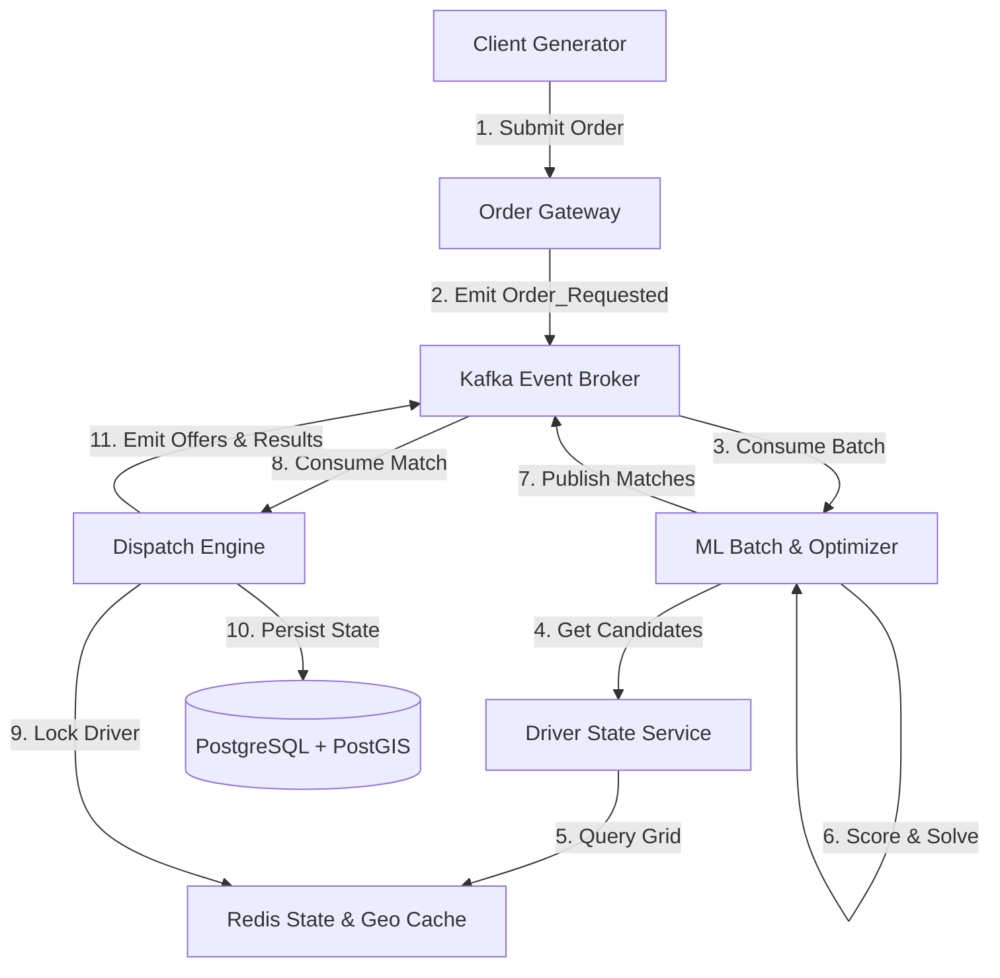

# RouteMatch

RouteMatch is a high-performance, event-driven geospatial dispatch and matching platform built using a microservices architecture. The platform scales dynamically to ingest driver telemetry, search candidates via H3 grids, score matches using an XGBoost model, optimize vehicle assignments globally using bipartite matching, and track life cycles via transactional state machines.

---

## 🏗️ System Architecture

The ecosystem consists of four specialized microservices communicating asynchronously via Kafka (Redpanda) and caching states in Redis:


```mermaid
graph TD
    Client[Client Generator] -->|1. Submit Order| GW[Order Gateway]
    GW -->|2. Emit Order_Requested| Kafka[Kafka Event Broker]
    
    Kafka -->|3. Consume Batch| ML[ML Batch & Optimizer]
    ML -->|4. Get Candidates| DS[Driver State Service]
    DS -->|5. Query Grid| Redis[Redis State & Geo Cache]
    
    ML -->|6. Score & Solve| ML
    ML -->|7. Publish Matches| Kafka
    
    Kafka -->|8. Consume Match| DE[Dispatch Engine]
    DE -->|9. Lock Driver| Redis
    DE -->|10. Persist State| DB[(PostgreSQL + PostGIS)]
    DE -->|11. Emit Offers & Results| Kafka
```

### Microservices Catalog

1. **[Order Gateway (Python FastAPI)](file:///home/ndbao/ndbao/up_project/routematch/source/services/order-gateway)**
   * **Port**: `9000` (mapped to host) / `8080` (internal)
   * **Role**: Ingests incoming customer orders, publishes `Orders_Requested` events to Redpanda, and runs a background state synchronization consumer updating local order caches from finalized events.
   
2. **[Driver State & Location Service (Go)](file:///home/ndbao/ndbao/up_project/routematch/source/services/driver-state)**
   * **Port**: `50051` (gRPC) / `9092` (Metrics)
   * **Role**: Ingests driver GPS telemetry, indexes positions using the **H3 Geospatial Index** at resolution 8, and provides high-performance ring-expansion queries (`BatchGetCandidates`) to locate close idle drivers.

3. **[ML Batch & Optimization Service (Python)](file:///home/ndbao/ndbao/up_project/routematch/source/services/ml-batch)**
   * **Port**: `8080` (internal)
   * **Role**: Accumulates order requests in sliding 5-second windows, calls `driver-state` via gRPC for candidates, loads the latest scoring model from the MLflow Registry, calculates bipartite cost matrices, and resolves matches globally via the Hungarian algorithm.

4. **[Dispatch & State Machine Engine (Go)](file:///home/ndbao/ndbao/up_project/routematch/source/services/dispatch-engine)**
   * **Port**: `9091` (Metrics)
   * **Role**: Manages order dispatch lifecycles. Uses Redis atomic locking (`NX EX`) to secure drivers, starts 15-second response tracking timers, processes driver accepts/rejects, writes interaction logs to PostgreSQL, and schedules retries or finalizes bookings.

---

## 📊 Centralized Monitoring & Telemetry

Centralized Prometheus and Grafana instances are deployed inside the Compose topology to scrape metrics across all components.

| Service | Port | Metric Scope | Instrumentation |
|---|---|---|---|
| **Prometheus** | `9090` | Scraper & Query Engine | Configured scrape target configs |
| **Grafana** | `3000` | Telemetry Dashboards | Pre-configured metrics views |
| **Order Gateway** | `9000` | Python runtime / API metrics | `prometheus-fastapi-instrumentator` |
| **ML Batch** | `8080` | Inference batch and runtime metrics | `prometheus-fastapi-instrumentator` |
| **Dispatch Engine** | `9091` | Go runtime and worker statistics | `prometheus/promhttp` |
| **Driver State** | `9092` | Go runtime and location write performance | `prometheus/promhttp` |

---

## 🚀 Getting Started

### 1. Build and Run Infrastructure & Services
Launch the complete microservices stack, including databases, brokers, MLflow, and monitoring tools:
```bash
docker compose -f source/infrastructure/docker-compose.yml up -d --build
```

### 2. Hydrate Redis Drivers
Populate mock driver coordinates and profiles in Redis (resolves H3 index rings):
```bash
uv run simulation/hydrate_redis.py
```

### 3. Run the Simulation
To test the end-to-end event-driven flow, launch the background simulators:

* **Driver Simulator** (subscribes to offers and sends accept/reject responses):
  ```bash
  uv run simulation/driver_simulator.py
  ```

* **Customer Traffic Generator** (simulates incoming order telemetry):
  ```bash
  uv run simulation/generation.py
  ```

### 4. Verify Monitoring Health
Verify that metrics endpoints are responding and active:
* **Prometheus Targets Check**: Curl the API endpoint to inspect scraper states:
  ```bash
  curl -s http://localhost:9090/api/v1/targets | jq '.data.activeTargets[] | {job: .labels.job, health: .health}'
  ```
* **Grafana Console**: Open `http://localhost:3000` (Credentials: `admin` / `admin`) to customize metric visualizations.

---

## 🧠 Offline Model Training & Feature Engineering

The system includes offline pipelines to process raw data and train/tune the XGBoost driver acceptance model:

1. **Feature Engineering**: Process raw interaction and order logs to build model-ready features (e.g., H3 demand, cyclical encoding, Bayesian smoothed accept rates):
   ```bash
   uv run training/feature_engineering.py
   ```
   *Outputs processed data to `data/processed/feature_data.csv`.*

2. **Model Training & Hyperparameter Tuning**: Train the model, run hyperparameter grid searches, evaluate metrics, and register it to the MLflow server:
   ```bash
   uv run training/training_model.py
   ```
   *Logs training runs to MLflow, registers model `RouteMatchScoring`, and saves the offline fallback pickle file to `models/xgb_scoring_model.pkl`.*

---


## 🧹 Tear Down & Clean Up
To stop all microservices and entirely purge docker containers, networks, and persistent database volumes:
```bash
docker compose -f source/infrastructure/docker-compose.yml down -v
```