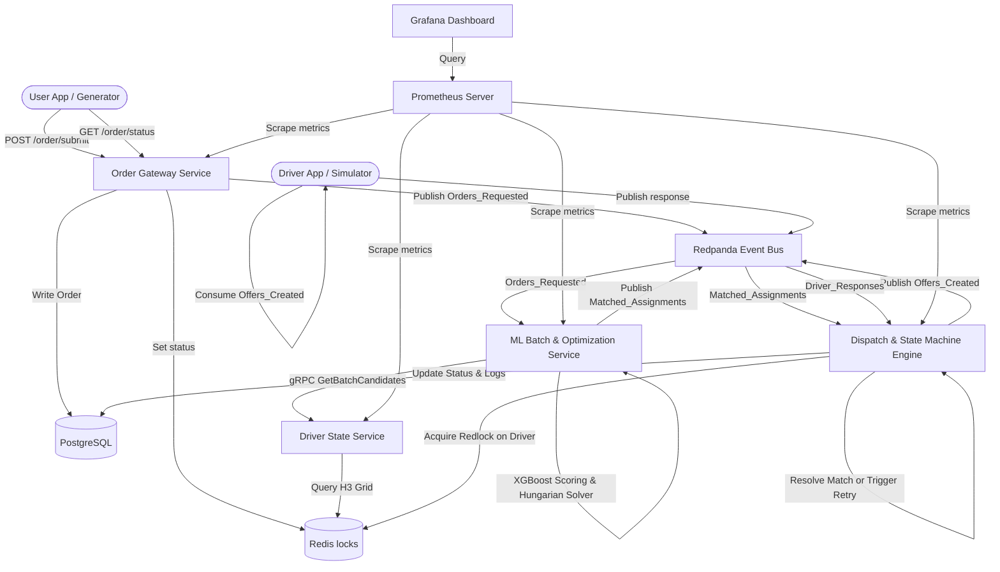

# RouteMatch System Architecture & Design

This document details the high-level and low-level system design of the RouteMatch microservices architecture. It specifies state ownership, data flows, database schemas, and event topologies.

---

## 1. High-Level Architecture Overview

RouteMatch is built as a highly decoupled, event-driven mesh of microservices optimized for low-latency matching and resilient state tracking.



---

## 2. Microservice Catalog

### 2.1 Order Gateway Service (Python / FastAPI)
* **Responsibility**: Ingests new ride requests from clients and exposes a polling status endpoint. Keeps HTTP threads stateless and offloads heavy computation.
* **Network Ports**: Exposes HTTP `/order/submit` and `/order/status/{order_id}` on port `8080` (mapped to host `9000`).
* **Background Worker**: Spawns an internal consumer thread that listens to Kafka topics (`Orders_Requested`, `Offers_Created`, `Orders_Finalized`, `Orders_Failed`) and synchronizes the statuses to Redis cache with a 5-minute TTL.

### 2.2 Driver State & Location Service (Go)
* **Responsibility**: Manages high-frequency GPS coordinate pings from active drivers and indexes them into H3 hexagonal cells.
* **Network Ports**: Exposes a high-performance gRPC server on port `50051`.
* **Geospatial Indexing**: Utilizes Uber's H3 library at resolution 8 (~0.74 km² per cell).
* **API Endpoints**:
  - `UpdateLocation`: Ingests GPS coords and updates H3 sorted sets in Redis.
  - `GetCandidates` / `BatchGetCandidates`: Computes H3 grid ring expansions (k=0 to k=3) to locate nearby available candidates.

### 2.3 ML Batch & Optimization Service (Python / FastAPI)
* **Responsibility**: Aggregates ride requests, retrieves nearby candidate drivers, scores matches using an ML model, and solves optimal bipartite assignments.
* **Optimization Window**: Uses a 5-second tumbling window or max size of 50 orders.
* **Model Scoring**: Vectorized XGBoost classifier predicting driver acceptance probability $P(\text{Accept})$.
* **Global Optimization**: Formulates a cost matrix $\text{Cost} = w_1 \times (1 - P(\text{Accept})) + w_2 \times \text{distance}$ and solves global assignments via SciPy's Hungarian algorithm (`linear_sum_assignment`).

### 2.4 Dispatch & State Machine Engine (Go)
* **Responsibility**: Orchestrates driver offers, timeouts, and match retries.
* **Lock Management**: Acquires exclusive Redis locks (`lock:driver:{id}`) to ensure a driver does not receive multiple concurrent offers.
* **Timeout Management**: Spawns a Go routine for each active offer with a 15-second tracking context.
* **Resolution**:
  - *Accept*: Updates order status to `matched`, writes interaction logs, and emits `Orders_Finalized`.
  - *Reject/Timeout*: Releases driver lock, caches the driver in order's rejected set, increments attempt count. If attempts exceed 3, marks order as `failed` and emits `Orders_Failed`. Else, routes order back to `Orders_Requested` for retry.

---

## 3. Data & State Ownership

| Data/State Type | Owner Service | Physical Store | Description |
| --- | --- | --- | --- |
| **Order Status Cache** | Order Gateway | Redis Hash (`order:status:{id}`) | Short-lived ephemeral state mapped for high-frequency client polling. |
| **Transactional Order States** | Order Gateway / Dispatch | PostgreSQL (`orders` table) | Long-term operational source of truth. |
| **Driver Location & Profile** | Driver State | Redis ZSet (`drivers:h3:...`) & Profile Hash | High-frequency geospatial coordinates and active driver statuses. |
| **Driver Rejections Cache** | Dispatch Engine | Redis Set (`order:rejected:{id}`) | Cache of rejected drivers per order to prevent repeated failed matches. |
| **Interaction History** | Dispatch Engine | PostgreSQL (`interaction_logs`) | Audit logs of matches and acceptance/rejection decisions. |

---

## 4. Kafka Topic Topology

All messages are wrapped in a standard `EventEnvelope` containing metadata for traceability.

```json
{
  "event_id": "uuid",
  "event_type": "topic_name",
  "event_version": 1,
  "occurred_at": "timestamp",
  "correlation_id": "uuid",
  "payload": { ... }
}
```

### Kafka Topics Flow:
1. **`Orders_Requested`**:
   - *Producer*: `order-gateway` (on new order submission) or `dispatch-engine` (on match retry).
   - *Consumer*: `ml-batch` (aggregates requests for the optimization window).
2. **`Matched_Assignments`**:
   - *Producer*: `ml-batch` (outputs bipartite assignments).
   - *Consumer*: `dispatch-engine` (starts driver offer flow).
3. **`Offers_Created`**:
   - *Producer*: `dispatch-engine` (on successful driver lock).
   - *Consumer*: `order-gateway` status sync, client-facing driver apps.
4. **`Driver_Responses`**:
   - *Producer*: Driver app client (accept / reject).
   - *Consumer*: `dispatch-engine` (closes the offer wait loop).
5. **`Orders_Finalized`**:
   - *Producer*: `dispatch-engine` (on driver acceptance).
   - *Consumer*: `order-gateway` status sync.
6. **`Orders_Failed`**:
   - *Producer*: `dispatch-engine` (on 3 failed attempts).
   - *Consumer*: `order-gateway` status sync.

---

## 5. Redis Key Schemas

### 5.1 Geospatial H3 Index
* **Key**: `drivers:h3:{h3_cell_hex}:{vehicle_type}` (e.g. `drivers:h3:8865b566e9fffff:bike`)
* **Type**: Sorted Set (ZSet)
* **Member**: `driver_id`
* **Score**: `timestamp` (GPS update time) or `index`

### 5.2 Driver State
* **Key**: `driver:{driver_id}:state`
* **Type**: Hash Map
* **Fields**:
  - `status`: `IDLE` | `ACTIVE` | `OFFLINE`
  - `lat`: float latitude
  - `lon`: float longitude
  - `driver_fatigue_index`: float [0.0, 1.0]
  - `driver_global_accept_rate`: float [0.0, 1.0]

### 5.3 Driver Lock
* **Key**: `lock:driver:{driver_id}`
* **Type**: String
* **Value**: `order:{order_id}`
* **TTL**: 20 seconds (acquired via `SET NX EX 20`)

---

## 6. PostgreSQL Relational Schema

```sql
CREATE TABLE drivers (
    driver_id VARCHAR(20) PRIMARY KEY,
    joined_date TIMESTAMP,
    vehicle_type VARCHAR(20),
    max_load_kg INT
);

CREATE TABLE orders (
    order_id VARCHAR(20) PRIMARY KEY,
    user_id VARCHAR(20),
    created_at TIMESTAMP,
    status VARCHAR(32) NOT NULL DEFAULT 'accumulating',
    status_updated_at TIMESTAMP,
    pickup_lat DOUBLE PRECISION,
    pickup_lon DOUBLE PRECISION,
    dropoff_lat DOUBLE PRECISION,
    dropoff_lon DOUBLE PRECISION,
    shipping_fee DOUBLE PRECISION,
    cod_amount DOUBLE PRECISION,
    distance_km DOUBLE PRECISION,
    requested_vehicle_type VARCHAR(20),
    service_type VARCHAR(20),
    is_raining BOOLEAN,
    hour_of_day INT
);

CREATE TABLE interaction_logs (
    interaction_id SERIAL PRIMARY KEY,
    order_id VARCHAR(20) REFERENCES orders(order_id),
    driver_id VARCHAR(20) REFERENCES drivers(driver_id),
    attempt_count INT NOT NULL DEFAULT 1,
    driver_lat DOUBLE PRECISION,
    driver_lon DOUBLE PRECISION,
    driver_distance_to_pickup DOUBLE PRECISION,
    driver_fatigue_index FLOAT,
    is_accepted INT, -- 0 = rejected/timeout, 1 = accepted
    offered_at TIMESTAMP
);

CREATE TABLE order_state_transitions (
    transition_id SERIAL PRIMARY KEY,
    order_id VARCHAR(20) REFERENCES orders(order_id),
    from_status VARCHAR(32),
    to_status VARCHAR(32) NOT NULL,
    driver_id VARCHAR(20) REFERENCES drivers(driver_id),
    attempt_count INT,
    reason VARCHAR(255),
    created_at TIMESTAMP NOT NULL DEFAULT NOW()
);
```
